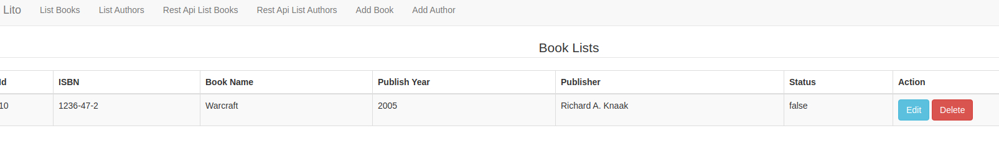
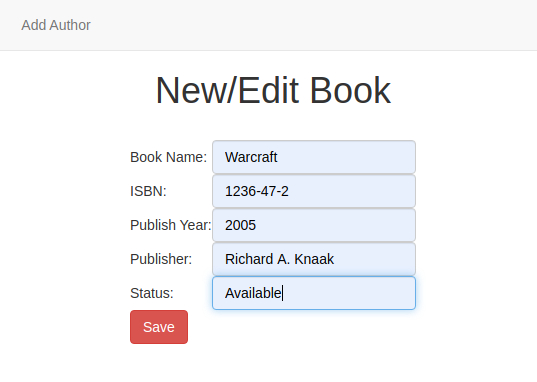
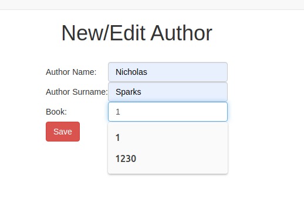

## Library Management System Lito for a university

## Technologies
Spring, DI, MVC, ORM, transactions.

## Tools
IntelliJ, Maven, MySQL, Apache Tomcat

## Requirements implemented

### Functional Requirements
This app manages many aspects of a university library system, including cataloging, search, circulation, and waiting list. The interface is web based, and the server needs to be hosted on the cloud, and is accessible from anywhere with Internet connection.

## My YouTube Channel for More instruction(Important to watch)  👇
https://youtu.be/qh8U8GVHS-o

#### Cataloging

1. A librarian is able to manage the catalog of the books.

2. A book item contains the following properties 

  * Author
  * Title
  * Call number
  * Publisher
  * Year of publication
  * Current status
  * Keywords

3. A librarian is able add, update, and delete books.
  * Update and deletion works together with search, i.e., a librarian has the capability to find a book through search, then decide to update/delete it.
  * A book cannot be deleted if it’s checked out by a patron.
  * Deleting a book also removes the waiting list for it, if there is any.
  * [Bonus Feature] Integrated with external APIs to simplify the input the book info based on ISBN.

## Github setup
1. Use a github UI application. E.g. Source Tree
2. Clone this repository to your workstation: https://github.com/rockyxam/MidTermBackEnd.git
3. Follow the instructions from this document to setup the environment on your local machine.

## Contributor:
Ravshan Khamidov COM-18

## Home Page

## List Page

## Add Book

## Add Author

## Request

